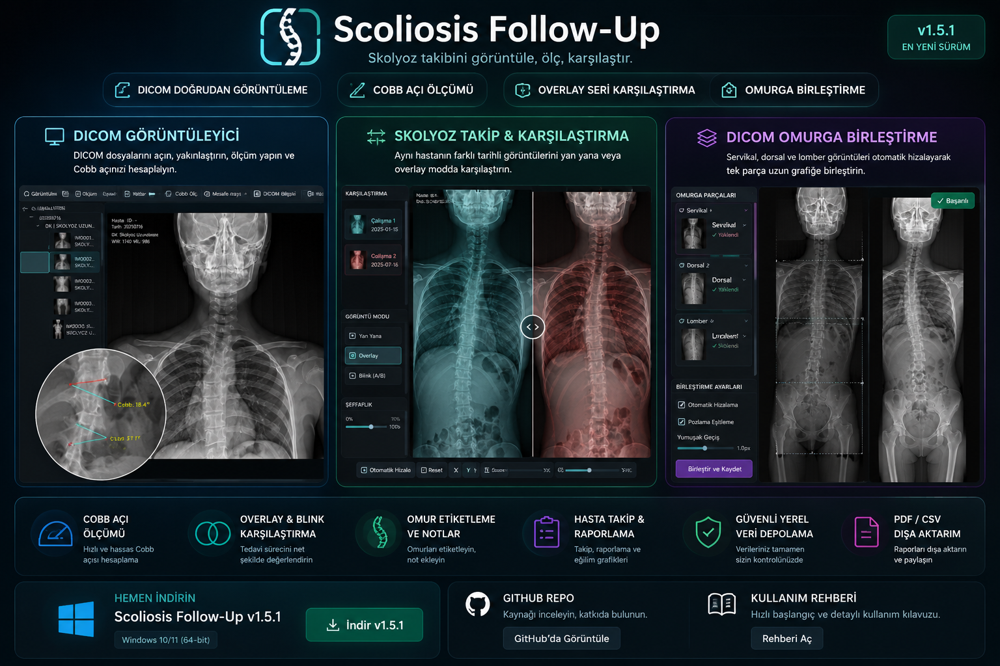
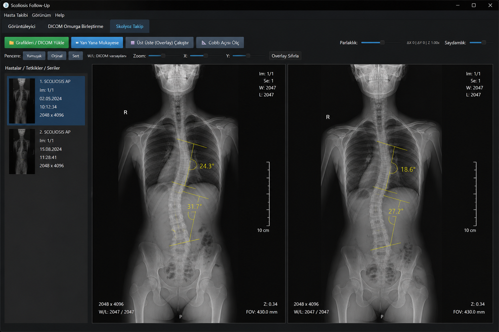
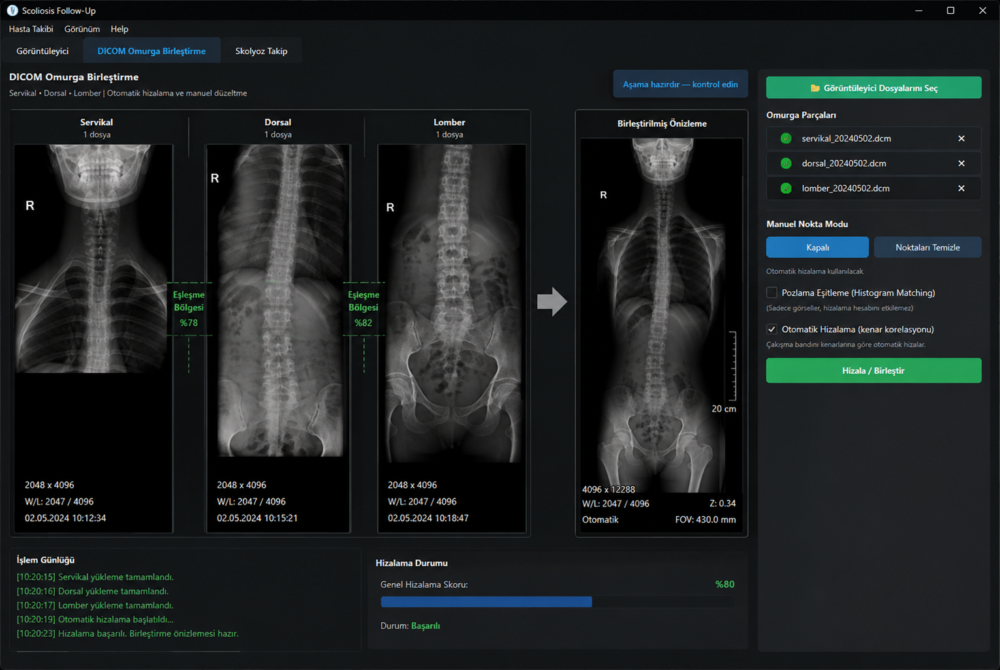

# Scoliosis Follow-Up

**Skolyoz radyografilerinin görüntülenmesi, ölçülmesi, karşılaştırılması, uzun dönem takip edilmesi ve parçalı omurga grafilerinin birleştirilmesi için geliştirilmiş Windows masaüstü uygulaması.**

Scoliosis Follow-Up; farklı tarihlerde elde edilen skolyoz grafilerini tek bir çalışma ortamında incelemek, Cobb ölçümlerini takip etmek, grafileri Overlay/Blink yöntemleriyle karşılaştırmak ve servikal–dorsal–lomber görüntüleri tek uzun omurga grafisi halinde birleştirmek amacıyla geliştirilmiştir.

> ⚠️ **Scoliosis Follow-Up klinik karar destek veya otomatik tanı sistemi değildir.**  
> Görüntüleme, ölçüm, teknik değerlendirme ve takip süreçlerini desteklemek amacıyla geliştirilmiş bir yazılımdır.

---

## 📸 Uygulamadan Görüntüler

### 🩻 DICOM Görüntüleyici

### 📈 Skolyoz Takip

### 🧩 DICOM Omurga Birleştirme

---

# ✨ Öne Çıkan Özellikler

## 🩻 DICOM Görüntüleyici

- DICOM ve desteklenen görüntü dosyalarını açma
- Hasta / tetkik / seri yapısında görüntü organizasyonu
- Window / Level ayarları
- Zoom ve pan
- Görüntüyü ekrana sığdırma
- Döndürme ve çevirme araçları
- Parlaklık ve görüntüleme ayarları
- DICOM metadata görüntüleme
- Cobb açısı ölçümü
- Mesafe ölçümü
- DICOM `PixelSpacing` mevcutsa gerçek **mm/cm ölçümü**
- Ölçüm ve işaretlemelerin görüntü üzerinde gösterilmesi
- Son açılan görüntülere hızlı erişim

---

## 📐 Skolyoz Takip

Scoliosis Follow-Up'ın temel modüllerinden biri farklı tarihlerde çekilen skolyoz grafilerinin longitudinal olarak karşılaştırılmasıdır.

- Referans ve kontrol grafilerini yan yana karşılaştırma
- **Overlay** karşılaştırma
- **Blink** karşılaştırma
- Görüntü şeffaflığı ayarı
- X / Y pozisyon düzeltmeleri
- Ölçek ayarı
- Rotasyon düzeltmesi
- Hizalamayı kilitleme
- Yan yana görüntülerde senkron çalışma
- Cobb ölçümlerinin tarih bazlı takibi
- Eğri bazlı Cobb takip sistemi
- Üst ve alt vertebra seviyelerine göre ölçüm gruplama
- Eğri yönü duyarlı takip
- Aynı tarihli tekrar ölçümlerin longitudinal seriyi bozmaması
- Cobb açı değişiminin hesaplanması
- Değişim hızının derece/yıl olarak hesaplanması
- Takip uyarıları
- Cobb geçmişi
- Cobb trend görünümü
- Hasta takip özeti

---

## 🎯 Otomatik Overlay Hizalama

Takip grafilerinin manuel olarak üst üste getirilmesine ek olarak otomatik registration desteği bulunmaktadır.

Otomatik hizalama sistemi:

- Anatomik görüntü özelliklerinden eşleşme noktaları bulur
- RANSAC tabanlı geometrik dönüşüm hesaplar
- X / Y kaydırmayı belirler
- Ölçek farkını hesaplar
- Küçük rotasyon farklılıklarını düzeltebilir
- Güvenilir olmayan hizalamaları otomatik olarak reddeder
- Aşırı kaydırma, ölçek veya rotasyon durumlarında kullanıcıyı uyarır

Projeksiyon bilgisi mevcutsa AP / PA / LAT uyumluluğu da değerlendirilir.

> Otomatik hizalama sonucu teknik bir başlangıç noktasıdır. Gerekirse manuel kontrollerle düzeltilebilir.

---

## 🧩 DICOM Omurga Birleştirme

Parçalı skolyoz grafilerinin tek uzun omurga görüntüsüne dönüştürülmesi için ayrı bir çalışma modülü bulunmaktadır.

Desteklenen yapı:

**Servikal → Dorsal → Lomber**

Özellikler:

- 2 veya 3 parçalı görüntü ile çalışma
- Otomatik hizalama
- Manuel hizalama
- Nokta tabanlı manuel düzeltme
- X / Y ince ayar
- Görüntü ölçek uyumu
- PixelSpacing tabanlı geometrik uyum
- Pozlama / yoğunluk eşleştirme
- Overlap bölgesinde yumuşak geçiş
- Cosine feather blending
- Seam görünürlüğünü azaltan birleştirme algoritması
- Birleşim bölgelerinin ayrı ayrı kalite değerlendirmesi
- Stitch Quality Score
- Final Verification
- Düşük kalite durumunda kullanıcı uyarısı
- Sonucun onaylanıp kilitlenmesi
- Birleştirilmiş görüntünün PNG ve DICOM olarak kaydedilmesi

Birleştirme sonucu kullanıcı tarafından doğrulanmadan final çıktı olarak kabul edilmez.

---

## 🔍 Teknik Görüntü Kalite Kontrolü

**1.6.0 ile teknik görüntü kalite kontrol modülü eklendi.**

Aktif görüntü veya seçili takip çifti için aşağıdaki kontroller yapılabilir:

- PixelSpacing kontrolü
- Gerçek mm/cm ölçüm uygunluğu
- AP / PA / LAT projeksiyon bilgisi
- Görüntü matrisi
- Ortalama parlaklık
- Kontrast dağılımı
- Ton uçlarında saturasyon
- Görüntü kenarlarında olası anatomi teması
- Hasta kimliği uyumu
- Tetkik tarih karşılaştırması
- Takip çiftinin projeksiyon uyumluluğu

Sonuçlar:

- ✅ Uygun
- ℹ️ Bilgi
- ⚠️ Uyarı

olarak sınıflandırılır.

> Bu modül görüntünün klinik yeterliliğine karar vermez. Teknik inceleme ve kullanıcı kontrolünü desteklemek amacıyla tasarlanmıştır.

---

## 🏥 PACS

Uygulamada PACS iletişimi için ayrı çalışma araçları bulunmaktadır.

- PACS bağlantı yapılandırması
- DICOM sorgulama / iletişim altyapısı
- PACS üzerinden görüntü çalışma akışını destekleme
- Seçilen DICOM görüntülerini uygulama içerisinde açma

PACS özellikleri kullanılan PACS sisteminin yapılandırmasına ve DICOM iletişim izinlerine bağlıdır.

---

## 👤 Hasta ve Tetkik Yönetimi

- Hasta kartı
- Hasta listesi ve arama
- Tetkik geçmişi
- Görüntü notları
- Kontrol takvimi
- Takip uyarıları
- Kullanıcı / rol sistemi
- İşlem geçmişi / audit kayıtları
- Karşılaştırma oturumlarını kaydetme
- Kayıtlı Overlay oturumlarını yeniden açma

---

## 📄 Raporlama

- Takip raporu
- Cobb ölçüm geçmişi
- Takip özeti
- Profesyonel rapor görünümü
- PDF dışa aktarma
- CSV takip verisi dışa aktarma
- Araştırma amaçlı anonimleştirilmiş çıktı araçları

---

# 🔄 Takip ve Karşılaştırma İş Akışı

Scoliosis Follow-Up yalnızca tek bir radyografiyi görüntülemek yerine **zaman içerisindeki değişimi görünür ve ölçülebilir hale getirmeyi** hedefler.

Örnek çalışma akışı:

**İlk çekim**

↓

**Kontrol çekimi**

↓

**Yan Yana / Overlay / Blink**

↓

**Otomatik veya manuel hizalama**

↓

**Cobb ölçümü**

↓

**Önceki ölçüm ile karşılaştırma**

↓

**Trend ve değişim analizi**

↓

**Takip raporu**

Bu yapı sayesinde farklı tarihlerde elde edilen görüntüler aynı çalışma ortamında değerlendirilebilir.

---

# 🔐 Lisans ve Güvenlik

Uygulama cihaz tabanlı lisanslama ve dağıtım güvenliği altyapısına sahiptir.

- Cihaz bazlı lisans doğrulama
- Sunucu taraflı lisans kontrolü
- RPC tabanlı lisans işlemleri
- Deneme süresi (Trial) yönetimi
- Kullanıcı ve rol kontrolleri
- Dağıtım bütünlük doğrulaması
- Güncelleme bütünlük kontrolü
- SHA-256 installer doğrulaması
- İmzalı güncelleme bilgileri
- Dağıtım öncesi güvenlik kontrolleri

Yönetici lisans araçları son kullanıcı dağıtım paketinden ayrı tutulmaktadır.

---

# 🔄 Otomatik Güncelleme Sistemi

Scoliosis Follow-Up yeni sürümleri GitHub Releases üzerinden kontrol edebilir.

Yeni sürüm bulunduğunda uygulama:

1. Yeni sürüm bilgisini gösterir
2. Kullanıcı onayıyla installer'ı indirir
3. İndirilen dosyanın **SHA-256** özetini doğrular
4. Dosya doğrulanırsa kurulumu başlatmayı teklif eder
5. Kurulum başlatıldığında çalışan uygulamayı kapatır

SHA-256 doğrulaması başarısız olan kurulum dosyası çalıştırılmaz.

---

# 💾 Veri Güvenliği ve Yedekleme

- Yerel veritabanı sağlık kontrolü
- Şifreli veritabanı yedeği
- Yedekten geri yükleme
- Yedekleme hatırlatmaları
- Tanı / diagnostic bundle oluşturma
- Uygulama hata günlüğü
- Eksik kaynak DICOM kontrolü

Geliştirme ortamında ayrıca **Project Control Center** üzerinden manuel proje restore noktaları oluşturulabilir.

Restore noktaları `.restore_points` klasöründe saklanır.

---

# 🖥️ Sistem

Scoliosis Follow-Up şu anda **Windows masaüstü ortamı** için geliştirilmektedir.

### Temel teknolojiler

- Python
- PySide6 / Qt
- pydicom
- pynetdicom
- OpenCV
- NumPy
- Pillow
- ReportLab
- SQLite

---

# 📦 Kurulum

Son kararlı sürümü GitHub üzerindeki **Releases** bölümünden indirebilirsiniz.

1. En güncel `ScoliosisFollowUp_Setup_x.x.x.exe` dosyasını indirin.
2. Kurulum dosyasını çalıştırın.
3. Kurulum tamamlandıktan sonra Scoliosis Follow-Up'ı başlatın.

> Son kullanıcı bilgisayarında Python veya ayrı bir geliştirme ortamı kurulması gerekmez.

---

# 🆕 Sürüm 1.6.0

Scoliosis Follow-Up **1.6.0**, görüntüleme, takip, ölçüm, kalite kontrolü ve uygulama altyapısında kapsamlı geliştirmeler içerir.

### Öne çıkan yenilikler

- Yenilenmiş profesyonel kullanıcı arayüzü
- Görüntüleyici ve takip araçlarında yeni ikon sistemi
- PixelSpacing destekli gerçek mm/cm mesafe ölçümü
- Eğri ve yön duyarlı Cobb takip altyapısı
- Cobb değişim hızı / derece-yıl hesaplaması
- Geliştirilmiş otomatik Overlay registration
- Translation, scale ve rotation destekli hizalama
- Hasta ve projeksiyon uyumluluk kontrolleri
- Geliştirilmiş DICOM omurga birleştirme
- Yeni seam blending ve kalite skoru
- Birleşim bazlı kalite değerlendirmesi
- Final Verification ve sonuç kilitleme
- Yeni Teknik Görüntü Kalite Kontrol modülü
- Yenilenmiş uygulama içi güncelleme sistemi
- SHA-256 installer doğrulaması
- Project Control Center restore noktası oluşturma
- Performans ve stabilite geliştirmeleri
- Güncellenmiş yayın doğrulama altyapısı

1.6.0 sürümü yayın öncesinde otomatik test paketi ile doğrulanmaktadır.

---

# ⚠️ Tıbbi Kullanım Hakkında

Scoliosis Follow-Up'ın geliştirilme amacı radyolojik görüntülerin görüntülenmesini, ölçülmesini, karşılaştırılmasını ve takip süreçlerinin organize edilmesini kolaylaştırmaktır.

Yazılım tarafından:

- oluşturulan görüntüler,
- hesaplanan ölçümler,
- Cobb değişim değerleri,
- teknik kalite uyarıları,
- otomatik hizalama sonuçları

**tek başına tanı veya tedavi kararı amacıyla kullanılmamalıdır.**

Klinik değerlendirme ve tıbbi kararlar yetkili sağlık profesyonelleri tarafından verilmelidir.

---

# 🚧 Proje Durumu

Scoliosis Follow-Up aktif olarak geliştirilmektedir.

Odaklanılan başlıca alanlar:

- görüntüleme iş akışının geliştirilmesi,
- skolyoz longitudinal takip araçları,
- omurga grafisi birleştirme kalitesi,
- otomatik görüntü hizalama,
- teknik görüntü kalite kontrolü,
- performans ve kullanıcı deneyimi.

---

# 🛡️ Güvenlik

Yayınlanan kurulum paketleri dağıtım öncesinde yerel bütünlük ve güvenlik kontrollerinden geçirilmektedir.

VirusTotal sonucu sürüme özgüdür. **1.6.0 installer yayınlandıktan sonra yeni dosya ayrıca taranmalı ve aşağıdaki bağlantı 1.6.0 sonucuyla güncellenmelidir.**

<!--
1.6.0 taramasından sonra etkinleştir:

✅ VirusTotal: 0 / XX güvenlik sağlayıcısı tehdit tespit etti.

[🔍 VirusTotal Tarama Raporunu Görüntüle](YENI_VIRUSTOTAL_URL)
-->

---

# 👨‍💻 Geliştirici

**Yusufcan ÖZDEMİR**

Radyoloji iş akışlarından edinilen saha deneyimi doğrultusunda geliştirilen Scoliosis Follow-Up; DICOM görüntüleme, skolyoz ölçümü, longitudinal takip ve omurga grafisi birleştirme işlemlerini tek bir masaüstü çalışma ortamında bir araya getirmeyi hedeflemektedir.

---

# 📄 Lisans

Bu repository'deki kaynak kodun ve uygulamanın kullanım koşulları proje lisansına tabidir.

© 2026 Scoliosis Follow-Up
