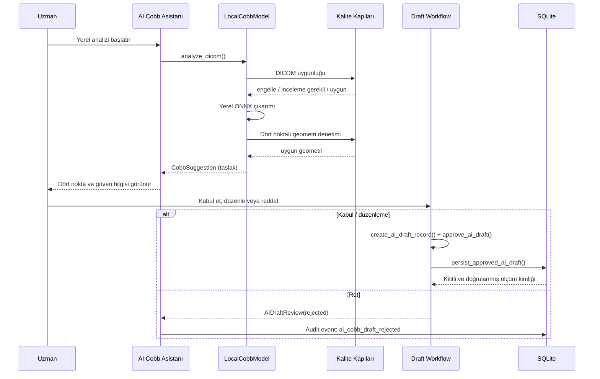

# ONNX Cobb Taslağı: Uzman Onayı ve Kalıcı Kayıt Akışı

**Durum:** Uygulama sözleşmesi tamamlandı; kullanıcı arayüzündeki kalıcı kayıt düğmesi kontrollü sonraki entegrasyon adımıdır.

## İlke

Yerel ONNX modeli hiçbir zaman doğrudan doğrulanmış ölçüm yazmaz. Model yalnızca dört son-plak noktasını, teknik güven bilgisiyle birlikte bir **AI taslağı** olarak üretir. Taslak görüntü üstünde görünür; uzman düzenlemeden veya kabul etmeden kalıcı ölçüm geçmişine girmez.

> Uzman ret kararı, bir klinik ölçüm kaydı oluşturmaz. Ret gerekçesi yalnızca audit olayı olarak saklanmalıdır.

## Çalışma akışı

## V2 model paketi

`manifest.json` V2 biçimi, ONNX dosyasının yolunu ve SHA-256 özetini korurken; kaynak depo/commit, kod-ağırlık-veri lisansı, ONNX opset, desteklenen görüntü türleri ve model kartını da zorunlu tutar. Uygulama bu alanlardan biri eksik olduğunda modeli çalıştırmaz.

| Grup | Zorunlu alanlar | Amaç |
|---|---|---|
| Bütünlük | `model_file`, `sha256`, `onnx_opset` | Yerel paketin kimliğini ve uyumluluğunu doğrulamak |
| Kaynak | `source_repository`, `source_commit`, `source_license` | Kodun izlenebilirliğini sağlamak |
| Veri ve ağırlık | `weights_license`, `dataset_license` | Kod lisansından bağımsız kullanım şartlarını görünür kılmak |
| Sözleşme | `task`, `output_schema`, `input_width`, `input_height` | Runtime giriş-çıkış biçiminin kesinliği |
| Model kartı | `intended_use`, `known_failure_modes`, `validation_summary` | Sınırlar ve doğrulama durumunu kullanıcıya açık tutmak |
| Görüntü sınırları | `supported_views`, `supported_modalities`, `excluded_conditions` | Uygunsuz görüntüde modelin çağrılmasını engellemek |

## Kalite kapıları

| Kapı | Bloklayan durum | İnceleme gerektiren durum | Sonuç |
|---|---|---|---|
| DICOM teknik uygunluğu | Boş/geçersiz boyut, çok kare, renkli piksel, desteklenmeyen modalite veya görüntü yönü | Model kartı V2 iken `ViewPosition` alanının boş olması | Blokta inference yok; incelemede taslak yalnızca uzman incelemesiyle gösterilir |
| Landmark geometrisi | Dört nokta yok, NaN/inf, görüntü sınırı dışı, soldan-sağa sıra bozuk, kısa çizgi, üst-alt sırası bozuk | Yok | Taslak oluşturulmaz |
| Güven | Model paketindeki `confidence_threshold` altında ortalama güven | Yok | Taslak uygulanamaz |
| Provenance | Eksik model sürümü veya V2 metadata | Yok | Kalıcı kayıt yazılmaz |

## Uzman eylemleri

Uzman onay penceresi, görüntü üstündeki aynı dört noktayı göstermeli; model sürümü, hash ön eki, kaynak/lisans özeti, güven değeri ve teknik kalite sonucu görünür olmalıdır. Uzman ya noktaları düzenleyip kabul eder ya da ret nedeni girer. Kabulde Cobb açısı düzenlenmiş noktalarla yeniden hesaplanır; ilk model açısı tek başına korunmuş klinik sonuç olarak kullanılmaz.

| Eylem | Kalıcı etkisi |
|---|---|
| Taslağı görüntüle | Ölçüm tablosuna yazmaz; görüntü ve audit olayı oluşturur |
| Taslağı kabul et | `MeasurementStatus.VERIFIED` ile kaydedilir ve SQLite kaydı kilitlenir |
| Noktaları düzenleyip kabul et | Düzenlenmiş dört noktadan açı yeniden hesaplanır; AI source/provenance korunur |
| Taslağı reddet | Cobb ölçümü oluşturmaz; ret nedeni audit olayına yazılır |

## SQLite provenance yerleşimi

Eski `cobb_measurements` tablosuna eklenen `provenance_json` alanı; model sürümü, kod/ağırlık/veri lisansları, model hash’i, güven, kalite kapıları, uzman kararı ve onay notunu saklar. `measurement_method` arama/sıralama uyumluluğu için `ai_onnx_cobb_expert_accepted_v2`, `measurement_version` ise model sürümü olarak tutulur. Eski ölçümler bu alan boşken okunmaya devam eder.

## Ana pencereye bağlanacak kontrollü sonraki adım

`run_modular.py` içindeki mevcut `_apply_ai_cobb_draft()` çağrısı ölçüm yazmaz. Yeni bir **“Taslağı uzman onayıyla kaydet”** eylemi şu şartların tamamında etkinleşmelidir: aktif taslak mevcut, açık DICOM kaynak dosyası eşleşiyor, dört nokta teknik olarak geçerli ve oturumdaki uzman adı boş değil. Eylem sırası `create_ai_draft_record()` → kullanıcı incelemesi/düzenlemesi → `approve_ai_draft()` → `persist_approved_ai_draft()` olmalıdır. Bu eylem ve ret audit UI’si, gerçek model paketi yüklenmeden önce ayrıca offscreen ve manuel smoke testiyle doğrulanacaktır.
