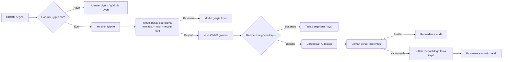

# Skolyoz AI Güçlendirme ve Güvenli Entegrasyon Planı

**Yazar:** Manus AI  
**Tarih:** 20 Ağustos 2026  
**Kapsam:** PySide6 tabanlı Scoliosis Follow-Up uygulamasında yerel, çevrimdışı ve manuel doğrulama gerektiren Cobb ölçüm önerisi.

## Yönetici özeti

GitHub araştırması, mevcut uygulamanın yapay zekâ tarafını güçlendirmek için yeterli teknik referans sağladı; ancak hiçbir harici projenin kodu veya model ağırlığı doğrudan ürüne alınmamalıdır. Mevcut uygulama zaten SHA-256 doğrulamalı, ONNX tabanlı, CPU üzerinde çalışan ve yalnızca dört noktalı taslak ölçüm üreten sağlam bir temel içerir. En güvenli gelişim yönü, bu temel üzerine **yetkili model paketi kabul süreci**, **görüntü/çıktı kalite kapıları**, **daha zengin provenance** ve **hasta bazlı ayrılmış doğrulama** eklemektir.

> Önerilen sistem tanı veya tedavi kararı vermez. Her AI sonucu, ekranda görünür dört noktalı kanıtı bulunan ve uzman tarafından kabul veya reddedilmesi gereken bir **taslak ölçüm** olarak kalacaktır.

## Mevcut temel ve dış kaynak değerlendirmesi

Uygulamadaki `LocalCobbModel`, yalnızca yerel ONNX modeli çalıştırır, model manifestini ve SHA-256 özetini doğrular, DICOM piksellerini yerelde hazırlar, dört noktalı çıktıyı ve güven değerini denetler. `AICobbAssistantDialog` sonucu yalnızca taslak olarak görüntüye aktarır; kullanıcı tarafından manuel kabul öncesinde kalıcı klinik sonuç olarak ele almaz. Eğitim dışa aktarma akışı da yalnızca uzman tarafından doğrulanmış ve kilitlenmiş dört noktalı etiketleri, kimliksiz PNG ve takma adlı manifest biçiminde dışa aktarır.

| Aday | Lisans ve bağımlılık durumu | Mevcut uygulamaya katkısı | Karar |
|---|---|---|---|
| Mazurowski Lab – `Scoliosis_project` | Apache-2.0; Python 3.8, PyTorch 1.7 ve MMDetection 2.16 tabanlı; giriş PNG, model ağırlıkları ayrı bağlantıda. [1] [2] | Ana eğri/Cobb iş akışı, model kartı ve deneysel değerlendirme referansı. | **Referans / olası yeniden eğitim kaynağı.** Kod veya ağırlık doğrudan eklenmeyecek. |
| Yi et al. – `Vertebra-Landmark-Detection` | MIT; Python 3.6 ve PyTorch 1.1 tabanlı; landmark veri biçimi ve ön eğitimli ağırlık bağlantısı var. [3] [4] | Landmark hedefleri, hata değerlendirme fikri ve çoklu omur iş akışı. | **En değerli teknik referans.** Modern ONNX adapter’a yeniden uygulanacak; eski runtime alınmayacak. |
| ScolioVis | Depoda açık lisans yok; Keypoint RCNN yaklaşımı ve model ağırlığı bağlantısı bulunuyor. [5] | Uçtan uca UX ve 68 anahtar nokta hedefi için fikir verir. | **Kod/ağırlık alınmayacak.** Lisans belirsiz. |
| zc402/Scoliosis | GPL-3.0; part-affinity fields tabanlı landmark/eğrilik çıkarımı. [6] | Geometrik son işlem ve hata senaryoları için akademik referans. | **Kod alınmayacak.** Copyleft lisans etkisi istenmiyor. |
| YOLOv11-Pose Cobb projesi | Depo MIT; 68 nokta ve üç Cobb açısı hedefliyor; ancak Ultralytics bağımlılığı AGPL-3.0/ayrı ticari lisans modeline sahip. [7] [8] | Çoklu eğri çıktı sözleşmesi için güncel fikir. | **Doğrudan bağımlılık alınmayacak.** Lisans ve sentetik veri genelleme riski var. |

## Hedef mimari

Yapay zekâ katmanı, uygulamanın DICOM görüntüleyici ve ölçüm katmanından ayrık kalmalıdır. Model yalnızca normalize edilmiş piksel tensörü alır; model çıktısı doğrudan ölçüm kaydı değildir. Önce kalite kapılarından geçer, sonra kullanıcıya taslak olarak sunulur ve yalnızca uzman onayıyla normal ölçüm akışına aktarılır.

## Aşama 1: Güvenli model paketi kabul katmanı

İlk kod değişikliği, yeni bir model yüklemek değil; yalnızca yetkili ve denetlenebilir model paketlerinin çalıştırılmasını sağlayan `AIModelPackageV2` sözleşmesini eklemektir. V1 manifestiyle geriye dönük uyumluluk korunur; V2 paketinde aşağıdaki alanlar zorunlu olur.

| Alan | Amaç |
|---|---|
| `model_version`, `model_file`, `sha256`, `onnx_opset` | Dosyanın kimliği, bütünlüğü ve çalışma uyumluluğu |
| `source_repository`, `source_commit`, `source_license` | Kaynak ve lisans izlenebilirliği |
| `weights_license`, `dataset_license` | Kod lisansından ayrı model/veri haklarının görünürlüğü |
| `task`, `output_schema`, `input_width`, `input_height` | Model giriş-çıkış sözleşmesinin kesinliği |
| `supported_views`, `supported_modalities`, `excluded_conditions` | Modelin hangi görüntülerde kullanılabileceğinin açık sınırı |
| `validation_summary`, `intended_use`, `known_failure_modes` | Model kartı, klinik sınırlar ve bilinen riskler |

Bu alanlardan herhangi biri eksikse uygulama modeli çalıştırmamalı; kullanıcıya açık gerekçe göstermelidir. Harici indirme, otomatik güncelleme veya telemetri bu aşamada eklenmemelidir.

## Aşama 2: Görüntü ve geometri kalite kapıları

Mevcut güven eşiği tek başına yeterli değildir. Uygulama aşağıdaki sonuçları üretmeli: **engellendi**, **uzman incelemesi gerekli** veya **taslak üretilebilir**. Geçiş koşulları yalnızca renkle değil, metin ve sayısal bağlamla görünmelidir.

| Kapı | Kontrol | Başarısızlık davranışı |
|---|---|---|
| Görüntü uygunluğu | Tek kare, iki boyutlu piksel matrisi, modelin desteklediği modalite ve görüntü yönü | AI çalışmaz; manuel ölçüm önerilir |
| DICOM bağlamı | PatientID, görüntü boyutu, rescale, MONOCHROME bilgisi ve okunabilir pixel array | AI çalışmaz; teknik hata kaydı oluşturulur |
| Landmark geometri | Dört ayrı nokta, sıfır uzunluklu olmayan çizgiler, görüntü sınırları içinde koordinatlar | Taslak üretilmez |
| Anatomik tutarlılık | Üst ve alt uç-plaka çizgilerinin beklenen sıralaması; açık model kartında tanımlı toleranslar | Taslak “inceleme gerekli” durumuna iner |
| Güven kalibrasyonu | Modelin kendi güveni ve doğrulama setindeki kalibrasyon raporu | Eşik altı sonuç uygulanamaz |
| Provenance | Model sürümü, hash, paket kaynağı, timestamp ve kullanıcı eylemi | Kayıt oluşturulmaz |

## Aşama 3: Veri ve doğrulama programı

Yerel eğitim dışa aktarma mekanizması, bundan sonra oluşturulacak ONNX modelin tek güvenilir başlangıç noktasıdır. Aynı hasta farklı eğitim/validasyon/test bölümlerine dağılmamalıdır; bölme **hasta düzeyinde** yapılmalıdır. Dış veri kullanılacaksa veri lisansı, etik/kurumsal izin, kimliksizleştirme yöntemi ve hedef popülasyon uyumluluğu ayrıca belgelenmelidir.

Doğrulama raporu, yalnızca ortalama hata değil; güven aralıkları, veri dışı kalma durumları, görüntü türü alt grupları, başarısız örnekler ve manuel ölçümle anlaşma analizini içermelidir. Bu metrikler saha verisi olmadan sayısal olarak iddia edilmeyecektir.

## Uygulama sırası

| Sürüm | Değişiklik | Teslim ölçütü |
|---|---|---|
| 1.0 | V2 model paketi validatoru ve model kartı görünümü | Eksik lisans, hash veya model kartında model bloklanır |
| 1.1 | Görüntü/geometri kalite kapıları ve audit alanları | Uygun olmayan görüntüde model çağrılmaz; nedeni görünür |
| 1.2 | Klinik dışı, yerel referans veriyle POC ONNX modeli | Sonuç yalnızca AI taslağıdır; dört nokta manuel düzenlenebilir |
| 1.3 | Hasta bazlı ayrılmış doğrulama raporu ve hata inceleme ekranı | Rapor veri dağılımı, hata durumları ve model kimliğini içerir |
| 2.0 | Çoklu eğri/landmark modeli için ayrı output schema | Yeni model, bağımsız lisans ve klinik doğrulama geçmeden etkinleşmez |

## İlk teknik iş paketi

İlk uygulanacak iş paketi, harici model indirmeden mevcut `ai/model_runtime.py` çevresinde aşağıdaki değişiklikleri kapsar:

1. V2 manifest parser ve model kartı alanları eklenir.
2. `AIModelStatus` içine kaynak, lisans ve uygunluk bilgileri eklenir.
3. `analyze_dicom()` öncesine görünüm/modality/multiframe kalite kapısı yerleştirilir.
4. `_decode_output()` sonrasına nokta sınırı, çizgi uzunluğu, sıralama ve geometri denetimi eklenir.
5. AI asistanında model kaynağı, sürümü, hash’i, lisansı ve engel nedeni görünür hale getirilir.
6. Geçersiz paket, uyumsuz görüntü, eşik altı güven, geometri hatası ve kullanıcı red/kabul akışları için unit test eklenir.

Bu iş paketi dış model çalıştırmadan önce uygulamanın emniyet çerçevesini güçlendirir. Yetkili ONNX model paketi daha sonra bu çerçeveye eklenir.

## Karar

**Evet, GitHub kaynaklarından yararlanarak AI tarafı güçlendirilebilir.** Fakat doğru yol, eski PyTorch projelerini veya belirsiz lisanslı ağırlıkları kopyalamak değildir. En iyi yaklaşım; MIT/Apache lisanslı araştırma projelerinden hedef şeması ve değerlendirme prensiplerini almak, mevcut yerel ONNX altyapısını güçlendirmek ve yalnızca lisansı/doğrulaması net bir modeli, uzman onaylı taslak üreticisi olarak yüklemektir.

## Kaynaklar

[1] [Mazurowski Lab – Scoliosis_project README](https://raw.githubusercontent.com/mazurowski-lab/Scoliosis_project/main/README.md)  
[2] [Mazurowski Lab – Apache-2.0 License](https://raw.githubusercontent.com/mazurowski-lab/Scoliosis_project/main/LICENSE)  
[3] [Yi et al. – Vertebra-Focused Landmark Detection README](https://raw.githubusercontent.com/yijingru/Vertebra-Landmark-Detection/master/README.md)  
[4] [Yi et al. – MIT License](https://raw.githubusercontent.com/yijingru/Vertebra-Landmark-Detection/master/LICENSE)  
[5] [ScolioVis GitHub repository](https://github.com/Blankeos/scoliovis)  
[6] [zc402/Scoliosis GitHub repository](https://github.com/zc402/Scoliosis)  
[7] [YOLOv11-Pose Cobb Angle Estimation repository](https://github.com/farah-bermudez/cobb-angle-estimation)  
[8] [Ultralytics GitHub repository and licensing notice](https://github.com/ultralytics/ultralytics)
