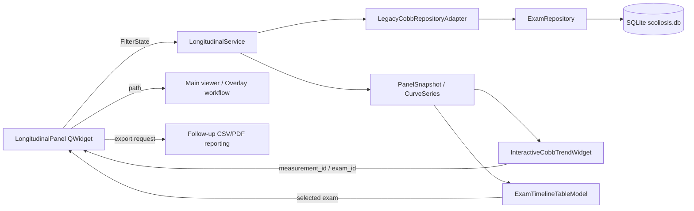

# Aşama 1 — İlerleme ve Takip Paneli Teknik Tasarımı

**Proje:** Scoliosis Follow-Up  
**Hedef sürüm:** Aşama 1 / ilk uygulanabilir sürüm  
**Platform:** Windows masaüstü, PySide6, yerel SQLite  
**Durum:** Uygulama öncesi teknik tasarım  
**Kapsam:** Cobb trend grafiği, hasta zaman çizelgesi, tetkik bağlamı, ölçüm özeti ve görüntüleyiciye geri dönüş

> Bu panel tanı, prognoz veya tedavi kararı üretmez. Panel yalnızca uygulamada kayıtlı tetkik ve ölçüm sonuçlarını tarih sırasına koyar, sayısal farkları gösterir ve ölçümün dayandığı kaynak görüntüye geri dönmeyi sağlar. Otomatik veya AI kaynaklı sonuçlar varsa manuel doğrulama durumu açıkça gösterilir.

## 1. Tasarım hedefi ve sınırlar

İlerleme ve Takip Paneli, mevcut **Longitudinal Takip Merkezi** yaklaşımını ürün içindeki daha görünür ve yeniden kullanılabilir bir çalışma alanına dönüştürür. İlk sürümde yeni bir ölçüm algoritması geliştirilmez; mevcut `MeasurementRecord`, `LegacyCobbRepositoryAdapter`, `ExamRepository.longitudinal_cobb_series()` ve `CobbTrendWidget` yeniden kullanılır. Böylece özellik, görüntü işleme katmanına müdahale etmeden ölçüm geçmişini ve tetkik bağlamını zenginleştirir.

İlk sürümün temel kullanıcı akışı aşağıdaki gibidir:

1. Kullanıcı hastayı seçer.
2. Sistem hastanın kayıtlı Cobb eğrilerini listeler.
3. Kullanıcı bir eğri seçer ve yalnızca doğrulanmış ölçümleri gösterme filtresini isterse etkinleştirir.
4. Sistem grafik, özet kartları ve tetkik zaman çizelgesini aynı bağlamda günceller.
5. Kullanıcı grafikteki veya zaman çizelgesindeki bir tetkiki ana görüntüleyicide açar.
6. Kullanıcı seçili iki tetkiki mevcut Overlay karşılaştırma akışına gönderir.

İlk sürüm kapsamı dışında bırakılanlar; yeni AI ölçüm modeli, klinik eşiklere dayalı tanı, uzaktan sunucu senkronizasyonu, hasta portalı, bildirim gönderimi ve ham DICOM dosyasına yazma işlemleridir.

## 2. Mevcut mimariyle uyum

Mevcut kod tabanında bu panel için önemli parçalar zaten bulunur. `modular_app/timeline/longitudinal_center.py` Qt-bağımsız seri ve snapshot hesaplarını, `modular_app/timeline/longitudinal_center_dialog.py` hasta/eğri seçimi ile trend görünümünü, `modular_app/timeline/cobb_trend.py` ise grafik ve metrik kartlarını sağlar. `modular_app/database/exam_repository.py` sınav, hasta profili, Cobb ölçümü ve takip sorgularını yerel SQLite üzerinden sunar.

| Mevcut bileşen | Paneldeki rolü | Aşama 1 kararı |
| --- | --- | --- |
| `ExamRepository` | Tetkik, hasta, Cobb ve profil verisinin tekil okuma/yazma noktası | Korunacak; yeni sorgular aynı repository katmanına eklenecek |
| `LegacyCobbRepositoryAdapter` | Eski SQLite Cobb kayıtlarını domain `MeasurementRecord` nesnelerine dönüştürür | Kullanılacak; UI doğrudan SQLite satırı tüketmeyecek |
| `longitudinal_center.py` | Eğri kimliği, tarih başına tek temsilci ve seri özetleri | Panelin ana domain/service katmanı olacak |
| `LongitudinalCenterDialog` | Mevcut read-only takip ekranı | Bileşenleri yeni panelde yeniden kullanılacak veya ortak widget'a çıkarılacak |
| `CobbTrendWidget` | Tarih sıralı grafik çizimi | Etkileşimli seçim ve `point_activated` sinyali ile genişletilecek |
| `FollowUpSummaryDialog` | Eğri bazlı özet ve tetkik listesi | Zaman çizelgesi satırları ve Overlay seçimi için referans alınacak |
| `run_modular.py` | Menü ve ana pencere entegrasyonu | Yalnızca açma, viewer'a geri dönüş ve refresh callback'leri bağlanacak |

### Önerilen modül düzeni

İlk uygulama aşamasında mevcut dosyaları mümkün olduğunca koruyup sorumlulukları aşağıdaki şekilde netleştirmek önerilir:

```text
modular_app/
├── database/
│   └── exam_repository.py             # SQLite sorguları ve yazma işlemleri
├── domain/
│   ├── contracts.py                   # MeasurementRecord ve provenance sözleşmeleri
│   └── measurement_adapter.py         # Legacy SQLite ↔ domain adaptörü
├── timeline/
│   ├── longitudinal_center.py         # Qt-bağımsız seri/snapshot hesapları
│   ├── longitudinal_service.py        # Panel için tek facade ve filtreleme akışı
│   ├── longitudinal_models.py         # TrendPoint, ExamTimelineItem, PanelSnapshot
│   ├── longitudinal_center_dialog.py  # Pencere kabuğu; mevcut yapı korunabilir
│   ├── longitudinal_panel.py          # Yeni yeniden kullanılabilir QWidget içeriği
│   ├── trend_chart.py                 # CobbTrendWidget'in etkileşimli sürümü
│   └── timeline_model.py              # QAbstractTableModel tabanlı tetkik listesi
└── tests/
    ├── test_longitudinal_service.py
    ├── test_longitudinal_panel.py
    └── test_longitudinal_chart_selection.py
```

`longitudinal_service.py`, repository ile Qt arasındaki tek iş akışı facade'ı olmalıdır. Böylece dialog, ana pencere veya ileride bir sekme aynı veriyi farklı UI kabuklarında kullanabilir.

## 3. Örnek UI tasarımı

### 3.1. Ana yerleşim

Panel, mevcut koyu klinik temaya uyacak şekilde üç dikey bölgeye ayrılır: bağlam/filtre başlığı, trend ve metrik bölgesi, tetkik zaman çizelgesi.

```text
┌──────────────────────────────────────────────────────────────────────────────┐
│ İLERLEME VE TAKİP PANELİ                                                      │
│ Hasta [ Yusuf A. | P001 ▼ ]  Eğri [ T5–T12 | Sağ ▼ ]  [✓ Doğrulanmış] [Yenile]│
├──────────────────────────────────────────────────────────────────────────────┤
│ Hasta: Yusuf A. | PatientID: P001 | 3 eğri | 5 zaman noktası | 1 tekrar gizli │
├────────────┬────────────┬────────────┬────────────┬────────────┬──────────────┤
│ İlk ölçüm  │ Son ölçüm  │ Değişim    │ Yıllık fark│ Tekrar     │ Zaman noktası│
│ 28.0°      │ 31.5°      │ +3.5°      │ +4.1°/yıl  │ 1 gizli    │ 5            │
│ 12.01.2024 │ 08.01.2026 │ sayısal    │ 727 gün    │ aynı tarih │ tekil tarih │
├──────────────────────────────────────────────────────────────────────────────┤
│ Cobb açısı (°)                                                                  │
│ 35 ┤                                                    ● 31.5°                 │
│ 30 ┤                         ● 28.0°       ● 29.0°                            │
│ 25 ┤        ● 24.0°                                                            │
│    └────── 12.01.24 ─────── 04.09.24 ───── 10.03.25 ───── 08.01.26 ──────────│
│    Noktaya tıklayın: tetkiki aç · Enter: seçili tetkiki görüntüleyicide aç    │
├──────────────────────────────────────────────────────────────────────────────┤
│ TETKİK ZAMAN ÇİZELGESİ                                                        │
│ Tarih       Tetkik / Seri       Son Cobb       Durum       İşlemler             │
│ 08.01.2026  AP standing         31.5°          ✓ Doğrulandı  Aç | Overlay      │
│ 10.03.2025  AP standing         29.0°          Taslak        Aç | Overlay      │
│ 04.09.2024  AP standing         28.0°          ✓ Doğrulandı  Aç | Overlay      │
│                                                                              ...│
├──────────────────────────────────────────────────────────────────────────────┤
│ [Seçili tetkiki aç] [İki tetkiki Overlay'e gönder] [CSV] [PDF]       [Kapat]   │
└──────────────────────────────────────────────────────────────────────────────┘
```

### 3.2. Bileşen hiyerarşisi

```text
LongitudinalPanel(QWidget)
├── TrackingContextBanner
├── FilterBar(QWidget)
│   ├── PatientSelector(QComboBox)
│   ├── CurveSelector(QComboBox)
│   ├── LockedOnlyCheckBox(QCheckBox)
│   ├── DateRangeSelector(optional, Aşama 1.1)
│   └── RefreshButton(QPushButton)
├── PatientContextCard(QFrame)
│   ├── PatientNameLabel
│   ├── PatientIdLabel
│   ├── ExamCountLabel
│   ├── CurveCountLabel
│   └── DataQualityBadge
├── MetricStrip(QWidget)
│   ├── MetricCard(first)
│   ├── MetricCard(latest)
│   ├── MetricCard(delta)
│   ├── MetricCard(annualized_delta)
│   ├── MetricCard(hidden_repeats)
│   └── MetricCard(time_points)
├── TrendSection(QFrame)
│   ├── ChartToolbar
│   │   ├── UnitLabel
│   │   ├── ShowValuesCheckBox
│   │   └── ResetViewButton
│   ├── InteractiveCobbTrendWidget
│   └── ChartLegend
├── TimelineSection(QFrame)
│   ├── TimelineHeader
│   │   ├── SearchLineEdit
│   │   ├── StatusFilter
│   │   └── ModalityFilter
│   ├── ExamTimelineTable(QTableView)
│   └── TimelineStatusLabel
└── ActionBar(QWidget)
    ├── OpenSelectedExamButton
    ├── SendTwoExamsToOverlayButton
    ├── ExportCsvButton
    ├── ExportPdfButton
    └── CloseButton
```

### 3.3. Bileşen sorumlulukları

| Bileşen | Sorumluluk | Bilmemesi gerekenler |
| --- | --- | --- |
| `FilterBar` | Seçimleri üretir ve `FilterState` sinyali yayınlar | SQLite sorgusu, DICOM okuma |
| `PatientContextCard` | Seçili hastanın kimliğini ve veri kalite durumunu gösterir | Ölçüm hesabı |
| `MetricStrip` | `PanelSnapshot` değerlerini görsel kartlara aktarır | Repository veya viewer callback'i |
| `InteractiveCobbTrendWidget` | Trend çizer, nokta seçimini yayınlar | Hasta listesi ve doğrudan DICOM açma |
| `ExamTimelineTableModel` | Satırları `ExamTimelineItem` olarak sunar | SQL ve iş kuralı |
| `LongitudinalService` | Repository'den snapshot ve tetkik satırlarını üretir | Qt çizimi |
| `LongitudinalPanel` | Sinyal/slot orkestrasyonu ve viewer köprüsü | Ham DICOM piksel işlemesi |
| `LongitudinalCenterDialog` | Pencere boyutu, modal/modeless yaşam döngüsü | Hesaplama mantığı |

### 3.4. Durumlar ve kullanıcı geri bildirimi

Panel, kritik durumları yalnızca renkle anlatmamalıdır. Her durum renk, metin ve mümkünse ikonla birlikte gösterilir.

| Durum | Görsel durum | Metin |
| --- | --- | --- |
| Veri yok | Nötr gri | “Bu hasta/eğri için kayıtlı Cobb ölçümü yok.” |
| Tek zaman noktası | Turkuaz bilgi | “Trend için en az iki farklı tetkik tarihi gerekir.” |
| Taslak ölçüm | Amber | “Taslak ölçüm; doğrulanmamış.” |
| Doğrulanmış ölçüm | Yeşil | “Doğrulandı — kaynak ve doğrulayan kullanıcı mevcut.” |
| Aynı tarihte tekrar | Amber bilgi | “Aynı tarihli tekrar ölçüm grafikte tek temsilciyle gösterildi; ayrıntılar zaman çizelgesinde korunur.” |
| PixelSpacing yok | Kırmızı/amber uyarı | “Bu ölçümün fiziksel birim doğrulaması için PixelSpacing bulunamadı; kayıt px ise px göster.” |
| Kaynak DICOM eksik | Kırmızı uyarı | “Kayıt var ancak kaynak dosya bulunamadı; görüntüleyicide açılamaz.” |
| Yenileme sürüyor | Pasif yükleniyor | “Takip verisi yenileniyor…” |

### 3.5. Grafik etkileşimi

Mevcut `CobbTrendWidget` çizim mantığı korunur; ancak Aşama 1'de şu etkileşimler eklenir:

| Etkileşim | Sonuç |
| --- | --- |
| Noktaya tek tıklama | Nokta vurgulanır, ilgili `measurement_id` ve tetkik satırı seçilir |
| Noktaya çift tıklama | Kaynak DICOM `activate_viewer_path(path)` callback'i ile açılır |
| Enter | Seçili zaman noktasını görüntüleyicide açar |
| Sağ tık | “Tetkiki aç”, “Overlay'e ekle”, “Ölçüm ayrıntısı” menüsü |
| Grafik boş alanına tıklama | Seçim temizlenir |
| Hover | Tarih, açı, vertebra çifti, durum ve kaynak dosya adını tooltip olarak gösterir |

Grafik noktaları aynı sınav tarihindeki tekrarları birleştirme kuralını değiştirmez. Seri hesaplaması, doğrulanmış kaydı taslak kayda tercih eder; aynı tarihli diğer kayıtlar zaman çizelgesinde görünür ve `hidden_repeat_count` ile belirtilir.

## 4. Uygulama mimarisi ve veri akışı



### 4.1. Yenileme akışı

`FilterBar` hasta, eğri veya doğrulanmış-only filtresini değiştirdiğinde `LongitudinalPanel` yeni bir `FilterState` oluşturur. Panel, servis facade'ına tek bir istek gönderir. Servis önce domain `MeasurementRecord` listesini alır, ardından `build_snapshot()` ile eğri serilerini üretir ve seçili eğriye ait tetkik satırlarını hazırlar. UI, snapshot ve timeline modelini tek transaction benzeri güncelleme içinde yeniler; böylece grafik eski hastaya, tablo yeni hastaya ait kalmaz.

```text
FilterState değişti
  → service.load_panel_snapshot()
  → adapter.list_measurements(patient_id)
  → build_snapshot(records, locked_only)
  → repository.list_patient_follow_up(patient_id)
  → service.apply_curve_and_date_filters()
  → PanelSnapshot döner
  → MetricStrip + Chart + Timeline aynı snapshot ile güncellenir
```

### 4.2. Viewer köprüsü

Panel, görüntüleyici sınıflarına doğrudan bağımlı olmamalıdır. Ana pencere, aşağıdaki iki callback'i panele verir:

```python
activate_viewer_path(path: str) -> None
send_exams_to_overlay(exams: list[dict]) -> None
```

`LongitudinalPanel`, satırdan veya grafik noktasından yalnızca `dicom_path`/`exam_id` bilgisini yükseltir. Ana pencere mevcut `open_viewer_files`, `set_overlay_mode` ve tetkik seçim akışlarını kullanarak DICOM'u açar. Kaynak dosya yoksa callback çalıştırılmaz ve kullanıcıya açık uyarı gösterilir.

## 5. Domain ve veri modelleri

### 5.1. Mevcut domain modeli

Aşama 1, mevcut `MeasurementRecord` ve `SourceContext` sözleşmelerini korur. Cobb trend serisinin kimliği aşağıdaki üçlüdür:

```python
CurveKey = tuple[str, str, str]
# (upper_vertebra, lower_vertebra, curve_direction)
```

Aynı vertebra çifti fakat farklı yön, ayrı seri olarak tutulur. Vertebra çifti eksik eski kayıtlarda seri etiketi “Vertebra çifti belirtilmemiş / eski kayıt” olur; bu kayıtlar sessizce kaybedilmez.

### 5.2. Yeni DTO modelleri

`modular_app/timeline/longitudinal_models.py` içinde Qt ve SQLite'dan bağımsız aşağıdaki veri taşıma nesneleri önerilir:

```python
from dataclasses import dataclass
from typing import Literal

CurveKey = tuple[str, str, str]

@dataclass(frozen=True)
class TrendPoint:
    measurement_id: int | None
    exam_id: int | None
    patient_id: str
    exam_date: str
    value: float
    unit: str
    curve_key: CurveKey
    status: Literal["draft", "verified", "rejected", "imported"]
    source: Literal["manual", "automatic", "ai_suggestion", "imported"]
    dicom_path: str
    source_sop_instance_uid: str = ""
    is_representative: bool = True
    hidden_repeat_count: int = 0

@dataclass(frozen=True)
class ExamTimelineItem:
    exam_id: int
    patient_id: str
    exam_date: str
    body_part: str
    modality: str
    study_description: str
    dicom_path: str
    latest_cobb: float | None
    latest_cobb_unit: str = "deg"
    latest_measurement_id: int | None = None
    latest_cobb_locked: bool = False
    measurement_count: int = 0
    overlay_session_count: int = 0
    source_exists: bool = False
    notes: str = ""

@dataclass(frozen=True)
class FilterState:
    patient_id: str
    curve_key: CurveKey | None = None
    locked_only: bool = False
    date_from: str = ""
    date_to: str = ""
    search_text: str = ""
    modality: str = ""

@dataclass(frozen=True)
class PanelSnapshot:
    patient_id: str
    patient_name: str
    filter_state: FilterState
    selected_series: CurveSeries | None
    curves: tuple[CurveSeries, ...]
    exams: tuple[ExamTimelineItem, ...]
    total_exams: int
    total_measurements: int
    total_hidden_repeats: int
    warnings: tuple[str, ...] = ()
```

`CurveSeries` mevcut yapısıyla kullanılabilir; `TrendPoint` yalnızca grafik ve tablo arasında kararlı kimlik taşımak için eklenir. `PanelSnapshot` tek bir yenileme sonucunu temsil eder ve UI bileşenlerinin aynı veri sürümünü kullanmasını sağlar.

### 5.3. SQLite şema kararı

Aşama 1 için yeni zorunlu tablo açmak yerine mevcut tabloların yeniden kullanılması önerilir:

| Kaynak tablo | Kullanılan alanlar | Panel kullanımı |
| --- | --- | --- |
| `exams` | `id`, `patient_id`, `exam_date`, `body_part`, `modality`, `study_description`, `dicom_path`, `notes` | Zaman çizelgesi ve kaynak tetkik |
| `cobb_measurements` | `id`, `patient_id`, `dicom_path`, `exam_date`, `angle_degrees`, `is_locked`, vertebra alanları, `point_data` | Trend noktaları, durum ve kaynak kanıtı |
| `patient_display_names` | `patient_id`, `display_name` | Hasta görünen adı |
| `patient_profiles` | `next_follow_up_date`, `diagnosis`, `notes` | Bağlam kartı; takip tarihi bu aşamada salt-okunur gösterilebilir |
| `comparison_sessions` | `patient_id`, kaynak yolları, hizalama alanları | Overlay geçmişi özeti |
| `audit_events` | `event_type`, `actor`, `created_at` | Ölçüm doğrulama ve görüntüleme geçmişi |

Yeni tablo ancak ileride kullanıcı tanımlı takip olayları, klinik notlar veya çoklu gözlem tipi bu yapıya sığmadığında eklenmelidir. Aşama 1'in amacı mevcut veriyi görselleştirmek olduğundan gereksiz migration riski alınmaz.

### 5.4. Veri kuralları

| Kural | Uygulama |
| --- | --- |
| Tarih sıralaması | `YYYYMMDD` ve `YYYY-MM-DD` okunur; geçersiz tarih grafik ekseninde metin olarak gösterilir ve yıllık oran hesaplanmaz |
| Aynı tarih tekrarı | Seri için tek temsilci seçilir; doğrulanmış kayıt taslağa tercih edilir, tekrar sayısı korunur |
| Eğri kimliği | Üst vertebra + alt vertebra + yön üçlüsü; farklı eğriler tek çizgide birleştirilmez |
| Birim | Cobb açıları derece (`deg`/`°`) olarak gösterilir; fiziksel mesafe için PixelSpacing yoksa mm/cm iddiası yapılmaz |
| Kaynak | DICOM dosyasına yazılmaz; yalnızca `dicom_path` ve SOP Instance UID referanslanır |
| Doğrulama | Kilitli/doğrulanmış kayıt düzenlenemez; taslak kayıt ayrı etiketlenir |
| Hasta bağlamı | Hasta seçimi değiştiğinde grafik, kart ve tablo birlikte yenilenir |
| Klinik yorum | “Artmış/azalmış” yalnızca sayısal değişim metnidir; klinik tanı veya prognoz cümlesi üretilmez |

## 6. API ve servis uç noktaları

Uygulama yerel masaüstü olduğu için Aşama 1'de gerçek HTTP sunucusu açılması önerilmez. “API” aşağıdaki iki katman olarak tanımlanır:

1. **Birincil uygulama içi servis API'si:** PySide6 UI'nin çağırdığı, tipli Python facade'ı.
2. **İsteğe bağlı yerel HTTP adaptörü:** İleride web istemcisi veya dış raporlama istemcisi gerektiğinde aynı servis facade'ına bağlanacak, henüz etkin olmayan REST sözleşmesi.

Bu ayrım, UI'nin SQL'e veya HTTP ayrıntılarına bağlanmasını önler. İlk implementasyonda birincil API uygulanır; REST uç noktaları sözleşme olarak belgelenir.

### 6.1. Uygulama içi servis API'si

```python
class LongitudinalService:
    def list_patients(self, query: str = "") -> list[PatientOption]: ...

    def list_curves(
        self,
        patient_id: str,
        *,
        locked_only: bool = False,
    ) -> tuple[CurveOption, ...]: ...

    def load_snapshot(self, filters: FilterState) -> PanelSnapshot: ...

    def get_measurement_detail(
        self,
        patient_id: str,
        measurement_id: int,
    ) -> MeasurementDetail: ...

    def get_exam_detail(
        self,
        patient_id: str,
        exam_id: int,
    ) -> ExamTimelineItem: ...

    def openable_source(self, patient_id: str, exam_id: int) -> SourceReference: ...

    def build_csv_export(self, snapshot: PanelSnapshot) -> ExportArtifact: ...

    def build_pdf_export(self, snapshot: PanelSnapshot, options: ReportOptions) -> ExportArtifact: ...
```

Servis metotlarının hiçbiri Qt widget döndürmez. Hata durumları tipli ve kullanıcıya çevrilebilir olmalıdır:

```python
class LongitudinalServiceError(Exception):
    code: str
    message: str

# Örnek code değerleri:
# patient_not_found, measurement_not_found, source_missing,
# invalid_date_filter, repository_error, export_error
```

### 6.2. Önerilen REST sözleşmesi

REST katmanı şu anda uygulanmayacak; ileride aynı yerel servis üzerinde kullanılmak üzere `/api/v1` altında tanımlanacaktır. Yanıtlarda hasta kimliği ve ölçüm kaynak bağlamı mutlaka korunur.

| Method | Endpoint | Amaç | Durum |
| --- | --- | --- | --- |
| `GET` | `/api/v1/patients?query=` | Hasta seçim listesi | Aşama 1 servis karşılığı uygulanır |
| `GET` | `/api/v1/patients/{patient_id}/curves?locked_only=` | Hastanın Cobb eğrilerini listeler | Aşama 1 servis karşılığı uygulanır |
| `GET` | `/api/v1/patients/{patient_id}/longitudinal` | Snapshot, seri ve zaman çizelgesini döndürür | Ana uç nokta |
| `GET` | `/api/v1/patients/{patient_id}/measurements/{measurement_id}` | Ölçüm ayrıntısını döndürür | Grafik/timeline detay paneli |
| `GET` | `/api/v1/patients/{patient_id}/exams/{exam_id}` | Tetkik ve kaynak durumunu döndürür | Görüntüleyici köprüsü |
| `GET` | `/api/v1/patients/{patient_id}/alerts` | Takip ve kalite uyarılarını listeler | Aşama 1.1 genişletmesi |
| `POST` | `/api/v1/patients/{patient_id}/exports` | CSV/PDF export işi başlatır | Aşama 1 sonu |

#### Ana GET `/longitudinal` sorgu parametreleri

```text
GET /api/v1/patients/P001/longitudinal
    ?curve_key=T5,T12,right
    &locked_only=false
    &date_from=20240101
    &date_to=20261231
    &search=
    &modality=DX
```

Önerilen yanıt:

```json
{
  "data": {
    "patient": {
      "patient_id": "P001",
      "display_name": "Yusuf A.",
      "exam_count": 5
    },
    "filter": {
      "curve_key": ["T5", "T12", "right"],
      "locked_only": false,
      "date_from": "20240101",
      "date_to": "20261231"
    },
    "summary": {
      "total_exams": 5,
      "total_measurements": 5,
      "total_hidden_repeats": 1,
      "first_value": 28.0,
      "latest_value": 31.5,
      "delta": 3.5,
      "annualized_delta": 4.1,
      "date_span_days": 727
    },
    "series": [
      {
        "curve_key": ["T5", "T12", "right"],
        "label": "T5–T12 | right",
        "points": [
          {
            "measurement_id": 101,
            "exam_id": 22,
            "exam_date": "20240112",
            "value": 28.0,
            "unit": "deg",
            "status": "verified",
            "source": "manual",
            "dicom_path": "C:/data/p001/20240112/ap.dcm",
            "source_exists": true
          }
        ],
        "hidden_repeat_count": 1
      }
    ],
    "exams": [
      {
        "exam_id": 22,
        "exam_date": "20240112",
        "body_part": "SPINE",
        "modality": "DX",
        "study_description": "AP standing",
        "latest_cobb": 28.0,
        "latest_measurement_id": 101,
        "latest_cobb_locked": true,
        "source_exists": true,
        "overlay_session_count": 1
      }
    ],
    "warnings": []
  },
  "meta": {
    "schema_version": "1.0",
    "generated_at": "2026-08-19T12:00:00Z"
  }
}
```

#### Hata yanıtı

```json
{
  "error": {
    "code": "source_missing",
    "message": "Tetkik kaydı bulundu ancak kaynak DICOM dosyası bulunamadı.",
    "details": {
      "patient_id": "P001",
      "exam_id": 22,
      "dicom_path": "C:/data/p001/20240112/ap.dcm"
    }
  }
}
```

API, ölçüm sonucunu “progression”, “worsening” veya benzeri klinik sınıflara dönüştürmez. `delta` ve `annualized_delta` alanları yalnızca sayısal farktır.

### 6.3. Repository'ye eklenecek sorgu metotları

Mevcut sorguların üzerine aşağıdaki read-only metotlar önerilir:

```python
class ExamRepository:
    def list_patient_exam_timeline(
        self,
        patient_id: str,
        *,
        curve_key: tuple[str, str, str] | None = None,
        locked_only: bool = False,
        date_from: str = "",
        date_to: str = "",
        search_text: str = "",
        modality: str = "",
    ) -> list[dict[str, Any]]: ...

    def get_measurement_with_exam(
        self,
        patient_id: str,
        measurement_id: int,
    ) -> dict[str, Any] | None: ...

    def list_curve_options(
        self,
        patient_id: str,
        *,
        locked_only: bool = False,
    ) -> list[dict[str, Any]]: ...
```

Bu sorguların `patient_id` filtresini zorunlu tutması gerekir. Demo modundaki tüm hastaları gösterme davranışı panelin normal akışına taşınmamalıdır.

## 7. Test ve kabul kriterleri

### 7.1. Domain/service testleri

| Test | Beklenen sonuç |
| --- | --- |
| Tek ölçüm | Grafik tek nokta gösterir; delta ve yıllık oran `None`/“—” olur |
| İki farklı tarih | İlk, son, delta, tarih aralığı ve yıllık fark doğru hesaplanır |
| Aynı tarihte taslak + doğrulanmış | Doğrulanmış kayıt seri temsilcisi olur; tekrar sayısı korunur |
| Farklı vertebra çiftleri | Her çift ayrı eğri seçeneği ve ayrı seri olur |
| Eksik vertebra alanı | Kayıt kaybolmaz; “eski kayıt” etiketiyle listelenir |
| Geçersiz tarih | Kayıt zaman çizelgesinde görünür; yıllıklaştırma yapılmaz |
| `locked_only=True` | Taslak kayıtlar seri ve grafikten çıkarılır |
| Eksik kaynak dosya | Satır görünür; açma eylemi pasif ve uyarı metni görünür |
| Hasta değişimi | Önceki hastanın grafik, kart ve satırları yeni snapshot ile tamamen değişir |
| PixelSpacing yok | Panel derece Cobb ölçümünü gösterir; mm/cm iddiası üretmez |

### 7.2. UI smoke testleri

`QT_QPA_PLATFORM=offscreen` ile aşağıdaki smoke testler çalıştırılmalıdır:

```text
1. QApplication ve LongitudinalPanel kurulabiliyor.
2. Hasta listesi dolduruluyor.
3. Hasta seçildiğinde eğri listesi ve metrik kartları güncelleniyor.
4. Tek ölçümde “trend için iki tarih gerekir” metni görünüyor.
5. Grafik noktası seçimi measurement_id yayıyor.
6. Timeline tek satır seçimini ve iki satır Overlay durumunu doğru yönetiyor.
7. Eksik DICOM kaynağında aç butonu pasif kalıyor.
8. Panel kapatılıp yeniden açıldığında kaynak veride değişiklik olmuyor.
```

### 7.3. Kabul kriterleri

Aşama 1 kabul edilir sayılmak için kullanıcı seçtiği hastanın eğrilerini, trend grafiğini, sayısal özet kartlarını ve tetkik zaman çizelgesini tek pencerede görebilmelidir. Grafik ile tablo aynı seçili eğriyi göstermeli; grafik noktasına veya tablo satırına yapılan seçim kaynak tetkiki ana görüntüleyicide açabilmelidir. Aynı tarihli tekrar ölçümler gizlenmemeli, yalnızca trendde temsilci seçilerek özetlenmeli; doğrulanmış ve taslak kayıtlar görsel ve metinsel olarak ayrılmalıdır. Panel hiçbir koşulda ham DICOM piksel matrisi veya metadata dosyasını değiştirmemelidir.

## 8. Uygulama sırası

| Sıra | İş paketi | Çıktı |
| --- | --- | --- |
| 1 | `.restore_points/` altında yedek oluşturma | Geri dönüş noktası |
| 2 | `longitudinal_models.py` ve `longitudinal_service.py` | Qt-bağımsız panel sözleşmesi |
| 3 | Repository timeline sorguları | Hasta/eğri/tetkik veri akışı |
| 4 | `ExamTimelineTableModel` | Büyük listeler için model tabanlı tablo |
| 5 | `InteractiveCobbTrendWidget` | Nokta seçimi ve tooltip |
| 6 | `LongitudinalPanel` | Filtre, grafik, kart ve tablo orkestrasyonu |
| 7 | Dialog/main window entegrasyonu | Menüden açma ve viewer callback'leri |
| 8 | CSV/PDF bağlama | Paneldeki filtreli görünümün dışa aktarımı |
| 9 | Test ve offscreen smoke | Kabul kriterlerinin doğrulanması |

### Önerilen ilk kod değişiklikleri

İlk kodlama iterasyonunda yeni HTTP server açılmamalı ve veritabanı migration'ı eklenmemelidir. Önce mevcut `LongitudinalCenterDialog` içindeki veri akışı `LongitudinalService` facade'ına taşınmalı, grafik nokta seçimi eklenmeli ve tetkik tablosu `QAbstractTableModel` yapısına geçirilmeli. Bu üç adım tamamlandığında panelin temel değer önerisi çalışır hale gelir.

## 9. Riskler ve önlemler

| Risk | Etki | Önlem |
| --- | --- | --- |
| Aynı tarihte birden fazla ölçüm | Trend yanlış yorumlanabilir | Temsilci seçimini doğrulanmış kayıt önceliğiyle merkezi serviste yapmak |
| Vertebra çifti eksikliği | Farklı eğriler birleşebilir | CurveKey'i üçlü tutmak ve eski kayıt etiketlemek |
| Kaynak dosyanın taşınması | Görüntüleyiciye dönüş başarısız olur | `source_exists` kontrolü ve pasif açma eylemi |
| UI'nin SQL'e bağlanması | Test ve ilerideki API geçişi zorlaşır | Service + DTO katmanı kullanmak |
| Çok büyük timeline | UI yanıtı yavaşlayabilir | `QAbstractTableModel`, filtreli sorgu ve gerekirse sayfalama |
| Klinik yorum algısı | Güvenlik ve sorumluluk riski | “Sayısal fark” ifadeleri, kaynak/durum etiketleri ve görünür uyarı metni |
| Mevcut testlerin kırılması | Sürüm gerilemesi | Önce mevcut dialog testleri, sonra yeni panel testleri; callback sözleşmelerini korumak |

## 10. Tasarım kararı özeti

Aşama 1 için önerilen mimari, mevcut uygulamanın zaten sahip olduğu longitudinal hesapları yeni bir **yeniden kullanılabilir QWidget + Qt-bağımsız service + DTO snapshot** yapısında birleştirir. UI, `PanelSnapshot` tüketir; repository SQL ayrıntıları service katmanında kalır; grafik ve zaman çizelgesi aynı veri sürümünü kullanır; görüntüleyiciye dönüş callback tabanlı olur.

Bu tasarımın en önemli kararı, ilk aşamada yeni veri tabanı tablosu veya gerçek ağ API'si eklememektir. Veri modeli mevcut `exams` ve `cobb_measurements` tablolarıyla karşılanır; API uç noktaları ise gelecekteki istemciler için kararlı bir sözleşme olarak tanımlanır. Böylece özellik düşük riskle uygulanabilir, mevcut ölçüm/provenance kuralları korunur ve sonraki aşamalarda takip planı, kalite uyarıları ve rapor dışa aktarma kolayca eklenebilir.

### Kod dayanakları

| Dosya | Tasarımda kullanılan mevcut dayanak |
| --- | --- |
| `modular_app/timeline/longitudinal_center.py` | CurveKey, CurveSeries, LongitudinalSnapshot ve tarih başına temsilci kuralı |
| `modular_app/timeline/longitudinal_center_dialog.py` | Hasta/eğri seçicileri, metrik kartları, grafik ve Overlay callback'i |
| `modular_app/timeline/cobb_trend.py` | Grafik çizimi, delta, yıllıklandırılmış fark ve tekrar ölçüm görünümü |
| `modular_app/timeline/follow_up_summary.py` | Eğri bazlı özet ve tek/çift tetkik seçim akışı |
| `modular_app/database/exam_repository.py` | SQLite şeması ve longitudinal/takip sorguları |
| `modular_app/domain/contracts.py` | MeasurementRecord, provenance, status ve source context sözleşmeleri |
| `modular_app/domain/measurement_adapter.py` | Legacy SQLite kayıtlarının domain nesnelerine dönüşümü |
